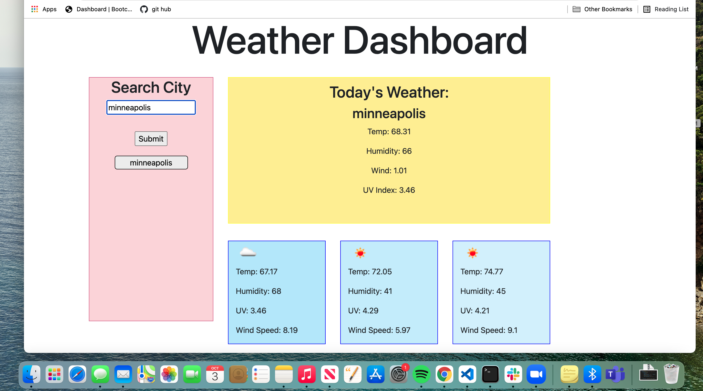

# weatherDash

## objective
Build a weather app using a third party api that allows you to search by city name. This will bring up the current weather data for the day. It displays the temp, humidity, wind speed and uv. Depending on the severity of the uv it changes the background color to green, yellow or red. It also brings up the forcast  for the next 5 days and includes the temp, humidity and windspeed while also displaying an icon for the weather. When a city is searched, the city name becomes a button, and when this button is clicked on, it displays the weather data for that city. When the page is refreshed the current cities are saved as buttons and stay on the screen.

## screenshot

## links

https://emilyelizabethdaniel.github.io/weatherDash/
https://github.com/emilyelizabethdaniel/weatherDash